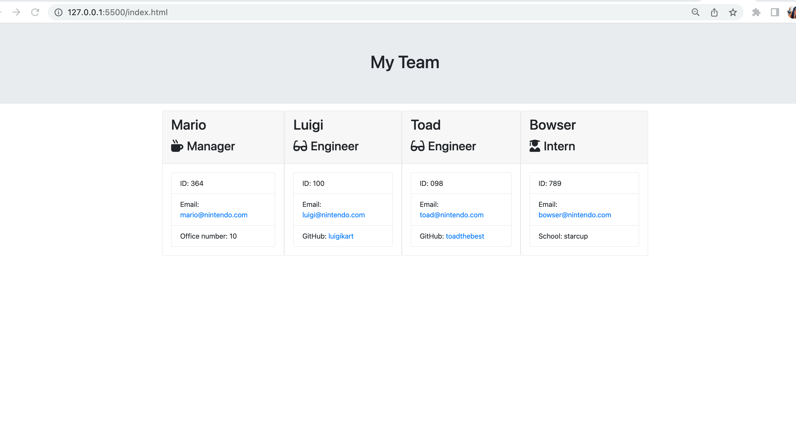

# 🏗️  OOP-team-profile-generator

----
## User Story 👇

> AS A manager
I WANT to generate a webpage that displays my team's basic info
SO THAT I have quick access to their emails and GitHub profiles

---
## 📋 Acceptance Criteria

GIVEN a command-line application that accepts user input

WHEN I am prompted for my team members and their information

THEN an HTML file is generated that displays a nicely formatted team roster based on user input

WHEN I click on an email address in the HTML

THEN my default email program opens and populates the TO field of the email with the address

WHEN I click on the GitHub username

THEN that GitHub profile opens in a new tab

WHEN I start the application

THEN I am prompted to enter the team manager’s name, employee ID, email address, and office number

WHEN I enter the team manager’s name, employee ID, email address, and office number

THEN I am presented with a menu with the option to add an engineer or an intern or to finish building my team

WHEN I select the engineer option

THEN I am prompted to enter the engineer’s name, ID, email, and GitHub username, and I am taken back to the menu

WHEN I select the intern option

THEN I am prompted to enter the intern’s name, ID, email, and school, and I am taken back to the menu

WHEN I decide to finish building my team

THEN I exit the application, and the HTML is generated

---
## 📐 Installation

* Install nmp 

* Install Inquirer 

* Install Jest 

---
## 💻 Test 

>When the user starts the program
>
>Then manager information is requested
>
>When the user select to enter data
>
>Then user enters data
>
>Then the HTML is generated

## Usage Profile Generator

1️⃣ `Open index.js integrated Terminal`

2️⃣ `Type node index.js on integrated Terminal`

3️⃣ `Select the profile you want to build`

4️⃣ `Once you have finished building all the profiles desired, select Finish and generate HTML, and open the index.html live server to see the results`

* ` 🔑 It's very IMPORTANT❗ that you build as many profiles before         selecting Finish and generate HTML`

---
## Mock-Up 📷 

The following image shows a mock-up of the generated HTML’s appearance and functionality:

